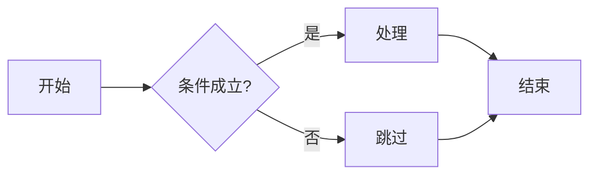
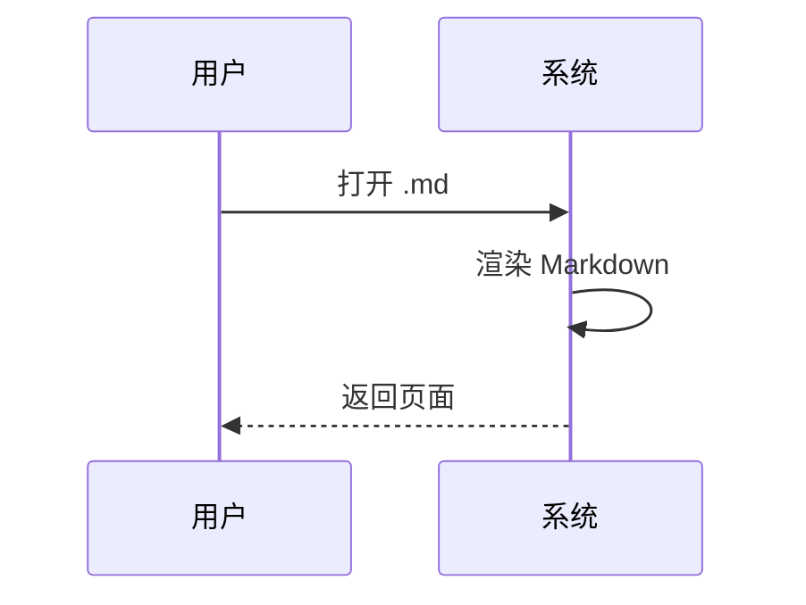

# MD Viewer 功能测试页

> 打开此文件应看到全部特性正确渲染。若某项不对，说明对应插件有问题。

## 1. 标题与文本
**粗体**、*斜体*、***粗斜体***、~~删除线~~、`行内代码`、[链接](https://example.com)、上标符号 H~2~O（注：下标需额外插件，此处仅文本）。

## 2. 任务列表
- [x] 已完成项
- [ ] 未完成项
- [ ] 第三个待办

## 3. 表格
| 功能 | 是否支持 |
| --- | --- |
| 表格 | ✓ |
| 任务列表 | ✓ |
| 数学公式 | ✓ |
| Mermaid | ✓ |

## 4. 代码高亮（多语言）
```js
const sum = (a, b) => a + b;
console.log(sum(1, 2));
```

```python
def add(a, b):
    return a + b
```

```sql
SELECT id, name FROM users WHERE active = 1 ORDER BY id;
```

```powershell
Get-ChildItem -Path . -Filter *.md | Select-Object Name
```

## 5. 引用与分割线
> 这是一段引用文字，用于测试 blockquote 样式。

---

## 6. 脚注
这里有一个脚注[^1]，还有一个[^2]。

[^1]: 第一个脚注的内容。
[^2]: 第二个脚注的内容。

## 7. Emoji
开心 :smile:  火箭 :rocket:  爱心 :heart:  对勾 :white_check_mark:

## 8. 数学公式（KaTeX）
行内公式：当 $a \ne 0$ 时，方程 $ax^2 + bx + c = 0$ 的解为 $x = \frac{-b \pm \sqrt{b^2-4ac}}{2a}$。

块级公式：

$$
\int_{0}^{\infty} e^{-x^2}\, dx = \frac{\sqrt{\pi}}{2}
$$

$$
\begin{aligned}
\nabla \times \vec{B} &= \mu_0 \vec{J} + \mu_0\varepsilon_0 \frac{\partial \vec{E}}{\partial t}
\end{aligned}
$$

## 9. Mermaid 图表




### 9b. 故意写错的图表（应就地显示错误提示，而非空白）
```mermaid
flowchart TD
    A --> 
    B[缺少目标节点
```

## 10. 列表嵌套
1. 第一层
   - 子项 A
   - 子项 B
2. 第二层
   - 子项 C
