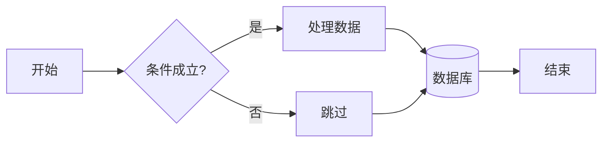
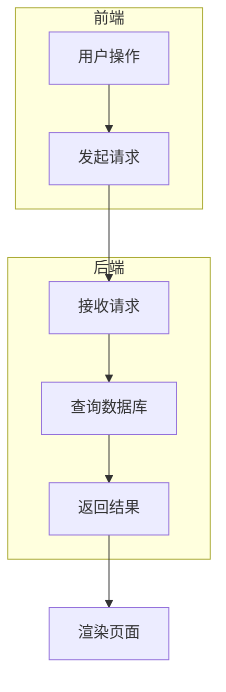
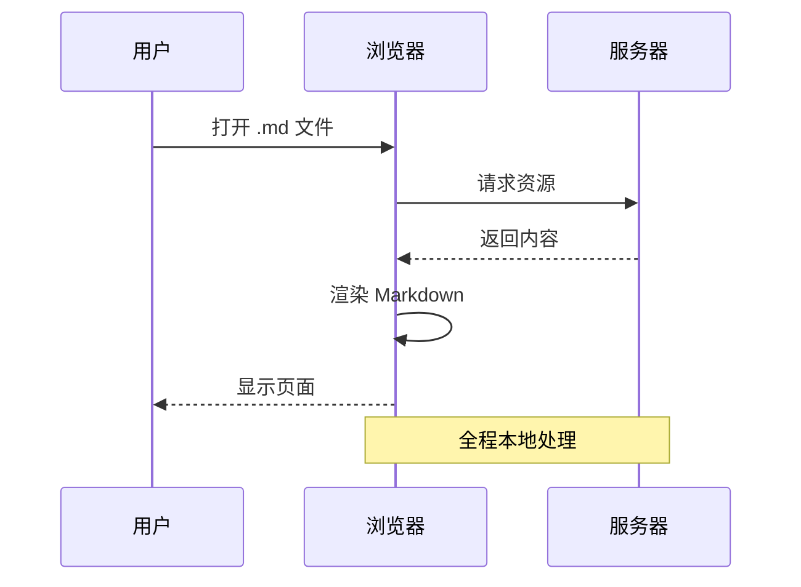
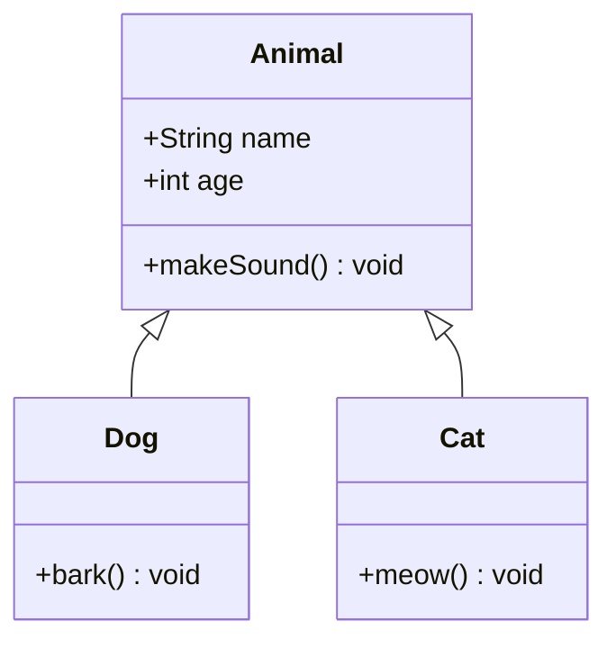
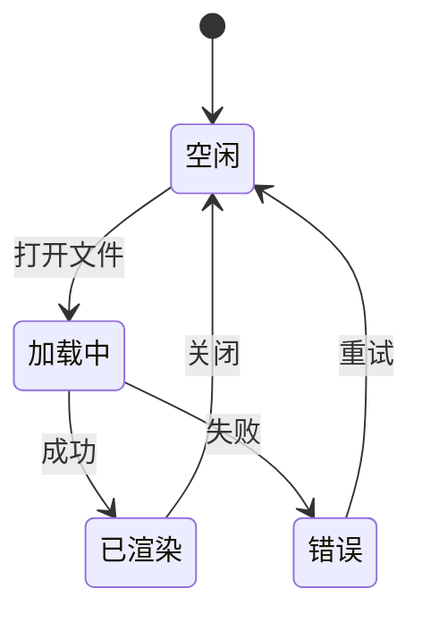
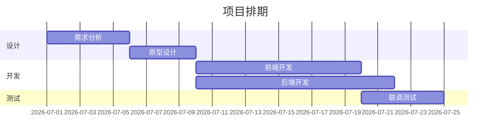
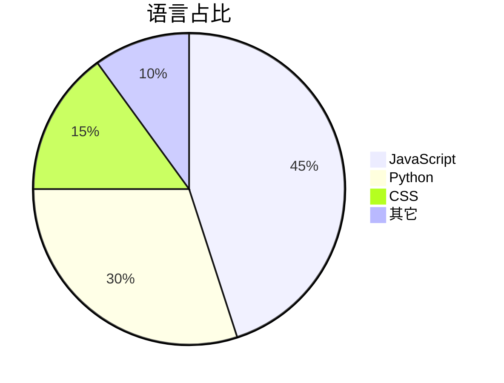
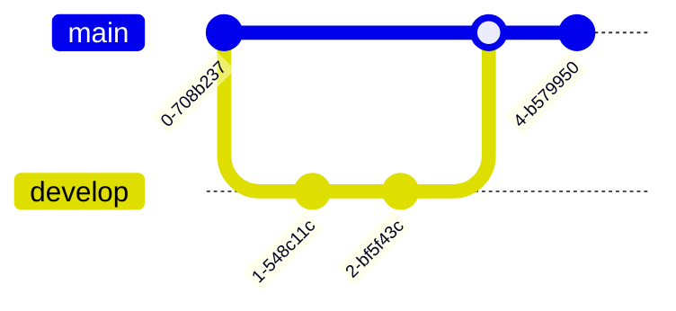

# MD Viewer 全面测试页

> 逐项检查每个特性是否正确渲染。若某项异常，把该项标题和现象告诉我即可定位。

---

## 一、文本样式

**粗体**、*斜体*、***粗斜体***、~~删除线~~、`行内代码`、==这不是高亮（markdown-it 默认不支持）==。

普通段落。连续两个换行才是新段落。
这一行只有一个换行，默认与上一行同段（breaks: false）。

自动链接：https://example.com 、 <https://github.com> 、邮箱 test@example.com

引用型链接：[Claude][c]、行内链接 [Anthropic](https://anthropic.com "带 title")。

[c]: https://claude.ai

---

## 二、标题层级（右侧目录应显示到 h3）

# H1 一级标题
## H2 二级标题
### H3 三级标题
#### H4 四级标题（不进目录）
##### H5
###### H6

---

## 三、列表

### 无序列表 + 多级嵌套
- 第一层 A
  - 第二层 A-1
    - 第三层 A-1-a
  - 第二层 A-2
- 第一层 B

### 有序列表
1. 第一步
2. 第二步
   1. 子步骤 2.1
   2. 子步骤 2.2
3. 第三步

### 任务列表
- [x] 已完成
- [ ] 未完成
- [x] 又一个完成
  - [ ] 嵌套未完成

---

## 四、表格

### 基础表格 + 对齐
| 左对齐 | 居中 | 右对齐 |
| :--- | :---: | ---: |
| a | b | c |
| 较长的内容单元格 | 中 | 123 |
| 行内代码 `x` | ✓ | ✗ |

### 宽表格（应可横向滚动）
| 列1 | 列2 | 列3 | 列4 | 列5 | 列6 | 列7 | 列8 | 列9 | 列10 |
| --- | --- | --- | --- | --- | --- | --- | --- | --- | --- |
| aaaaaa | bbbbbb | cccccc | dddddd | eeeeee | ffffff | gggggg | hhhhhh | iiiiii | jjjjjj |

---

## 五、代码高亮（多语言）

### JavaScript
```js
const sum = (a, b) => a + b;
console.log(sum(1, 2)); // 3
async function main() {
  const res = await fetch('/api');
  return res.json();
}
```

### Python
```python
from dataclasses import dataclass

@dataclass
class Point:
    x: int
    y: int

def add(a: int, b: int) -> int:
    return a + b
```

### TypeScript
```typescript
interface User { id: number; name: string; }
const users: User[] = [{ id: 1, name: "Ann" }];
```

### JSON
```json
{
  "name": "md-viewer",
  "version": "1.1.0",
  "nested": { "arr": [1, 2, 3], "flag": true }
}
```

### Bash / PowerShell
```bash
#!/usr/bin/env bash
for f in *.md; do echo "$f"; done
```

```powershell
Get-ChildItem -Path . -Filter *.md | Select-Object Name, Length
```

### 无语言标注的代码块
```
这是没有语言标注的纯文本代码块
第二行
```

行内 `inline code` 也要有底色。

---

## 六、引用与分割线

> 单层引用。
>
> > 嵌套引用第二层。
> >
> > > 第三层。

引用里带其它元素：
> **加粗** 和 `代码` 和 [链接](https://example.com)
>
> - 引用里的列表项
> - 第二项

---

## 七、脚注

正文引用脚注[^note1]，还有第二个[^note2]，以及行内式[^3]。

[^note1]: 第一个脚注内容，可以有 **格式**。
[^note2]: 第二个脚注，包含 [链接](https://example.com)。
[^3]: 第三个脚注。

---

## 八、Emoji

:smile: :rocket: :heart: :white_check_mark: :fire: :tada: :bug: :warning: :bulb: :100:

---

## 九、数学公式（KaTeX）

行内公式：当 $a \ne 0$ 时，$ax^2 + bx + c = 0$ 的解为 $x = \dfrac{-b \pm \sqrt{b^2-4ac}}{2a}$。

块级公式：

$$
\int_{0}^{\infty} e^{-x^2}\, dx = \frac{\sqrt{\pi}}{2}
$$

矩阵：

$$
\begin{pmatrix} a & b \\ c & d \end{pmatrix}
\begin{pmatrix} x \\ y \end{pmatrix}
=
\begin{pmatrix} ax+by \\ cx+dy \end{pmatrix}
$$

多行对齐：

$$
\begin{aligned}
\nabla \cdot \vec{E} &= \frac{\rho}{\varepsilon_0} \\
\nabla \times \vec{B} &= \mu_0 \vec{J} + \mu_0\varepsilon_0 \frac{\partial \vec{E}}{\partial t}
\end{aligned}
$$

---

## 十、Mermaid 图表（重点测试）

### 10.1 流程图 Flowchart（横向）


### 10.2 流程图（纵向 + 子图）


### 10.3 时序图 Sequence


### 10.4 类图 Class


### 10.5 状态图 State


### 10.6 甘特图 Gantt


### 10.7 饼图 Pie


### 10.8 Git 图


### 10.9 故意写错的图（应就地显示红框错误提示，而不是空白，且不影响其它图）
```mermaid
flowchart TD
    A -->
    B[缺少目标节点
```

---

## 十一、HTML 内联（html:true）

<div style="padding:10px;border:1px solid #888;border-radius:6px;">
这是一段 <b>内联 HTML</b>，带 <span style="color:#0969da;">彩色文字</span>。
</div>

<details>
<summary>点击展开（details/summary）</summary>

隐藏的内容在这里，包含 **Markdown**？（注意：details 内的 markdown 可能不解析）

</details>

---

## 十二、图片

相对路径图片（若无此文件应显示裂图占位，属正常）：


带链接的图片：

[](https://example.com)

---

## 十三、特殊字符与转义

- 尖括号：`<div>` `</div>`
- 与号：`A & B`
- 管道符在代码里：`a | b`
- 反引号：`` `code` ``
- 星号转义：\*不是斜体\*
- 数学符号：α β γ Σ ∫ ∞ ≠ ≤ ≥ → ⇒

---

## 十四、超长行与换行

这是一行非常非常长的文本用来测试正文的最大宽度限制和自动换行是否正常工作aaaaaaaaaaaaaaaaaaaaaaaaaaaaaaaaaaaaaaaaaaaaaaaaaaaaaaaaaaaaaaaaaaaaaaaaaaaaaaaaaaaaaaaaaaaaaaaaaaaaaaaaaaaaaaaaaaaaaaaaaaa 结束。

---

## 十五、综合验收清单

| 特性 | 预期 | 勾选 |
| --- | --- | :---: |
| 标题目录 | 右侧显示 h1-h3 | ☐ |
| 代码高亮 | 多语言着色 | ☐ |
| 表格 | 对齐 + 横向滚动 | ☐ |
| 任务列表 | 复选框 | ☐ |
| 脚注 | 底部编号跳转 | ☐ |
| Emoji | 图形化 | ☐ |
| KaTeX | 公式排版 | ☐ |
| Mermaid ×8 | 全部渲染 | ☐ |
| Mermaid 错误图 | 红框提示不空白 | ☐ |
| 深色切换 | 图表配色跟随 | ☐ |
| 源码切换 | 顶栏「源码」按钮 | ☐ |

> **主题测试**：点右上角 🌙 切换深/浅色，重点看 8 个 Mermaid 图配色是否跟随变化。
> **源码测试**：点顶栏「源码」按钮，应显示原始 Markdown 文本。
